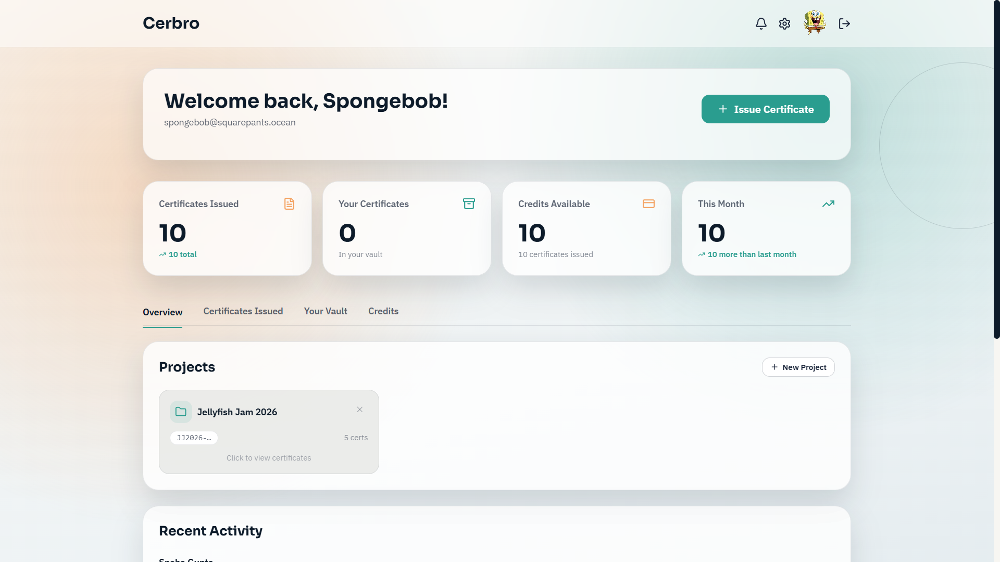
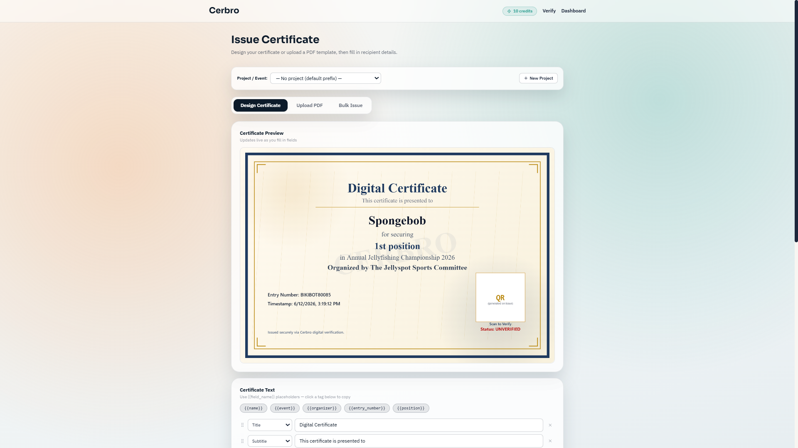
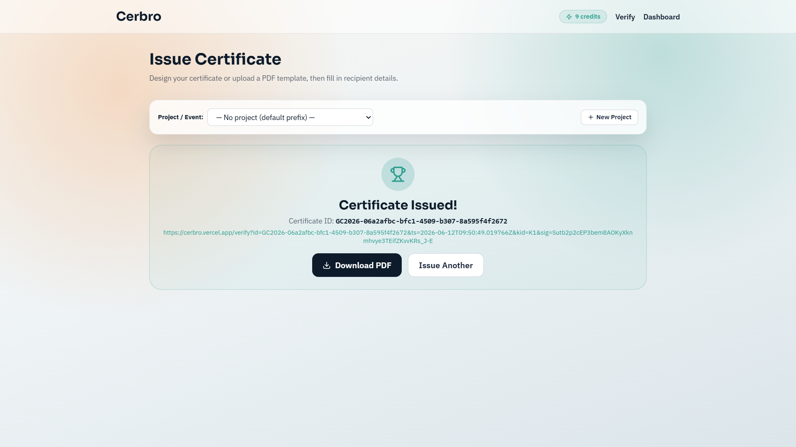
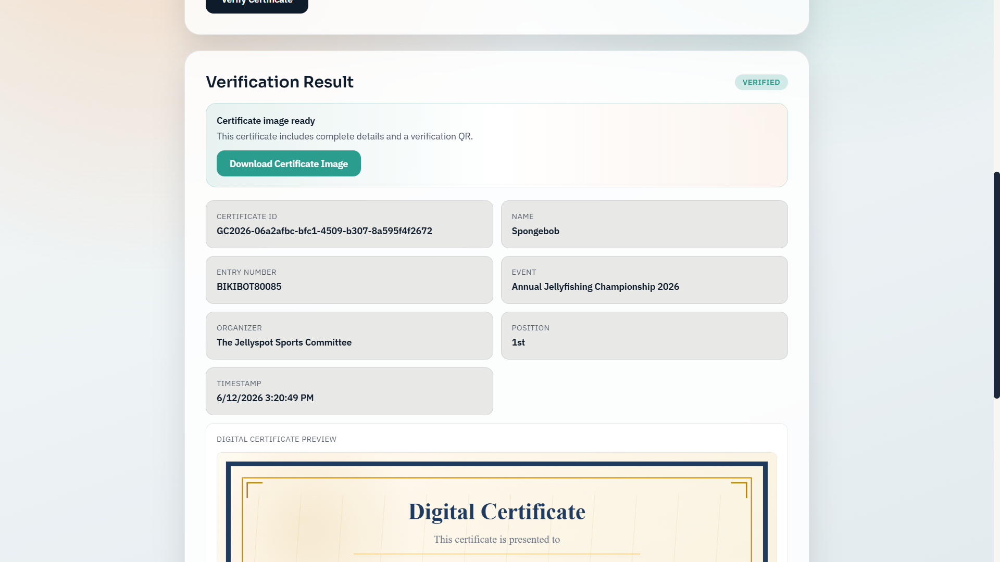

# Cerbro — Certificate Platform

Full-stack platform for issuing, managing, and verifying digitally signed certificates. Every certificate gets a unique ID, an HMAC-SHA256 signature, and a scannable QR code that links to a live verification page.

Live → **[cerbro.vercel.app](https://cerbro.vercel.app)**

---

## Screenshots










---

## Features

- **Issue certificates** — canvas designer or upload your own PDF template; QR + cert ID are overlaid automatically
- **Bulk issue** — upload a CSV, get a ZIP of signed PDFs in one request
- **Project folders** — organise certificates by event; cert IDs use the event prefix (e.g. `DC2026-…`)
- **Instant verification** — scan the QR or paste the cert ID; signature is verified against the backend
- **Credit system** — 1 credit per certificate; balance tracked in real-time via Firestore
- **Firebase Auth** — email/password and Google OAuth
- **Dashboard** — overview stats, per-project drill-down, recent activity
- **Settings** — update profile, change password, export all data as ZIP, delete account

---

## Tech Stack

| Layer | Tech |
|---|---|
| Frontend | React 18, Vite, Tailwind CSS, jsPDF, lucide-react |
| Auth | Firebase Authentication |
| Credits | Firebase Firestore (real-time `onSnapshot`) |
| Backend | FastAPI (Python), Uvicorn |
| Database | MongoDB Atlas (Motor async driver) |
| Signing | HMAC-SHA256 |
| PDF overlay | pypdf + reportlab |
| QR codes | `qrcode[pil]` (backend), `qrcode` npm (frontend preview) |

---

## Local Setup

### Prerequisites

- Node.js 18+
- Python 3.10+
- MongoDB Atlas cluster (or local MongoDB)
- Firebase project with **Authentication** and **Firestore** enabled

### Frontend

```bash
cd frontend
npm install
cp .env.example .env
npm run dev               # http://localhost:5173
```

**`frontend/.env`**
```env
VITE_API_BASE_URL=http://localhost:8000
VITE_PUBLIC_VERIFY_BASE_URL=https://your-frontend.vercel.app

VITE_FIREBASE_API_KEY=
VITE_FIREBASE_AUTH_DOMAIN=
VITE_FIREBASE_PROJECT_ID=
VITE_FIREBASE_STORAGE_BUCKET=
VITE_FIREBASE_MESSAGING_SENDER_ID=
VITE_FIREBASE_APP_ID=
VITE_FIREBASE_MEASUREMENT_ID=
```

### Backend

```bash
cd backend
python -m venv .venv

.venv\Scripts\activate        # Windows
source .venv/bin/activate     # macOS / Linux

pip install -r requirements.txt
cp .env.example .env
uvicorn main:app --reload     # http://localhost:8000
```

**`backend/.env`**
```env
ALLOWED_ORIGINS=http://localhost:5173

MONGODB_URL=mongodb+srv://<user>:<pass>@cluster.mongodb.net/
MONGODB_DB=cerbro

FIREBASE_SERVICE_ACCOUNT_JSON={"type":"service_account", ...}

CERT_SECRET_KEY=<generate with: python -c "import secrets; print(secrets.token_hex(32))">
CERT_KEY_ID=K1
CERT_ID_PREFIX=GC2026
CERT_VERIFY_BASE_URL=https://your-frontend.vercel.app/verify
```

---

## API Reference

All routes except `GET /api/certificates/verify` require `Authorization: Bearer <Firebase ID token>`.

| Method | Route | Description |
|--------|-------|-------------|
| `POST` | `/api/certificates/issue` | Issue a single certificate (multipart/form-data) |
| `POST` | `/api/certificates/bulk-issue` | Bulk issue from CSV — returns ZIP or JSON |
| `GET` | `/api/certificates/verify` | Verify a certificate by ID + signature (public) |
| `GET` | `/api/certificates/` | List all certificates for the current user |
| `GET` | `/api/projects/` | List projects with cert counts |
| `POST` | `/api/projects/` | Create a project |
| `DELETE` | `/api/projects/{id}` | Delete a project |
| `GET` | `/api/users/me` | Get / create user doc (initialises 10 credits) |
| `POST` | `/api/users/me/credits/add` | Add credits `{ "amount": N }` |
| `GET` | `/api/users/me/export` | Download all data as ZIP |
| `DELETE` | `/api/users/me` | Delete account and all associated data |

---

## Bulk Issue CSV Format

```csv
name,entry_number,position,email,mobile_number,hall,organizer
Alice Johnson,2024CSE0001,1st,alice@example.com,9800000001,Hall A,Tech Club
Bob Smith,2024CSE0002,2nd,bob@example.com,9800000002,Hall B,Tech Club
Carol White,2024CSE0003,Participant,carol@example.com,9800000003,Hall C,Tech Club
```

Only `name` is required. All other columns are optional and can be set as form defaults.

---

## Deployment

**Frontend** — deploy `frontend/` to Vercel. Add all `VITE_*` vars in the Vercel project settings. The `frontend/vercel.json` already handles SPA routing.

**Backend** — deploy to Railway, Render, or any Python host. Set all backend env vars and:

```env
ALLOWED_ORIGINS=https://your-frontend.vercel.app
```

---

## Firestore Security Rules

```js
rules_version = '2';
service cloud.firestore {
  match /databases/{database}/documents {
    match /users/{userId} {
      allow read: if request.auth != null && request.auth.uid == userId;
      allow write: if false; // writes only via Admin SDK (backend)
    }
  }
}
```
